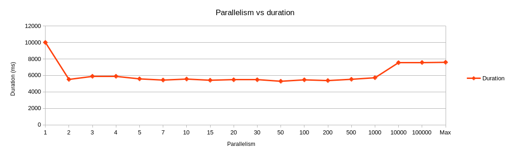

# disk-read-experiment

Is it faster to run node.js disk operations with maximal parallelism? Or to chain them? Or something in between? This experiment tries to find out.

The test app is the equivalent to `du` - Go through a directory tree, stat every entry and get its size. Tally it up.

### Usage

```bash
npm install
./src/bin/du.js -h
./src/bin/experiment.js -h
``` 

Then follow the instructions.

### Results

The experiment was performed against my projects folder, with about 400K files, on a laptop SSD.

```bash
src/bin/experiment.js /path/to/my/projects/folder -p "1 2 3 4 5 7 10 15 20 30 50 100 200 500 1000 10000 100000 0"
```



It seems limiting parallelism to 1 is the worst case scenario. There is probably a lot of empty waiting time between IO calls. While node is orchestrating callbacks, the disk sits idle.

Switching to 2 "threads" fixes the empty wait times, and we get from 10s down to the optimal time of around 6s. Adding more "threads" doesn't improve things further, presumably because they will just line up in the IO queue.

Performance degrades to around 8s between 1,000 and 10,000 async calls at a time. I presume some wait queue overflows, causing additional allocations?

Either way, the conclusion is, best schedule a few "threads" to do IO, but probably no more than about `$number_of_cpu`-s. If there is some magical RAID disk or something, this should allow for optimal IO scheduling. Doing `Promise.all()` all the time will visibly degrade the performance on large workloads. Best apply some kind of a job queue system (see implementation of this project), or whatever modern version of [async.js](https://www.npmjs.com/package/async) is (I don't know, as I have naturally rolled out my own).
